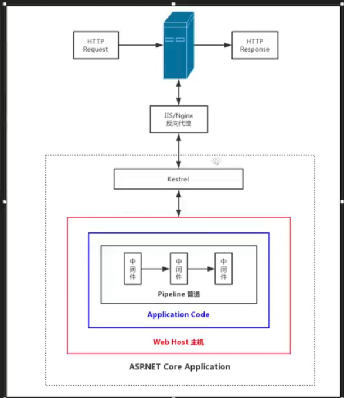
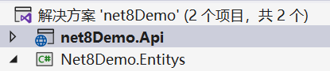
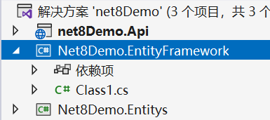

# yg_Net8Demo

### 技术栈

- ASP.NET 8.0 WEBAPI 框架
- MySQL 8.2
- EF Core + 仓储模式+数据传输对象+自动映射
- 标准 Web API 应用代码结构



### 跨域问题

**原因：** 在不同域之间进行数据交互

```
/*服务扩展类*/
public static class ServiceExtensions
{
    // 跨域设置
    public static void ConfigureCors(this IServiceCollection services)
    {
        services.AddCors(options =>
        {
            options.AddPolicy("AnyPolicy", builder =>
            {
                builder.AllowAnyOrigin()
                    .AllowAnyMethod()
                    .AllowAnyHeader();
            });
        });
    }
}
```

### 实体

创建实体类库 net8Demo.Api


### EF Core ORM 框架

**映射配置方法：**

1. 按约定（基础方法，常用）
2. 数据注解：特性、字段长度、字段类型、字段名称，更加直观和方便，功能有限
3. Fluent API：编码的方式、设计层面、关系映射应该是独立的

默认情况下，所有的映射都是在上下文中配置，这样会造成项目臃肿和耦合性高，难以维护，所以独立维护映射关系

创建类库项目：Net8Demo.EntityFramework

